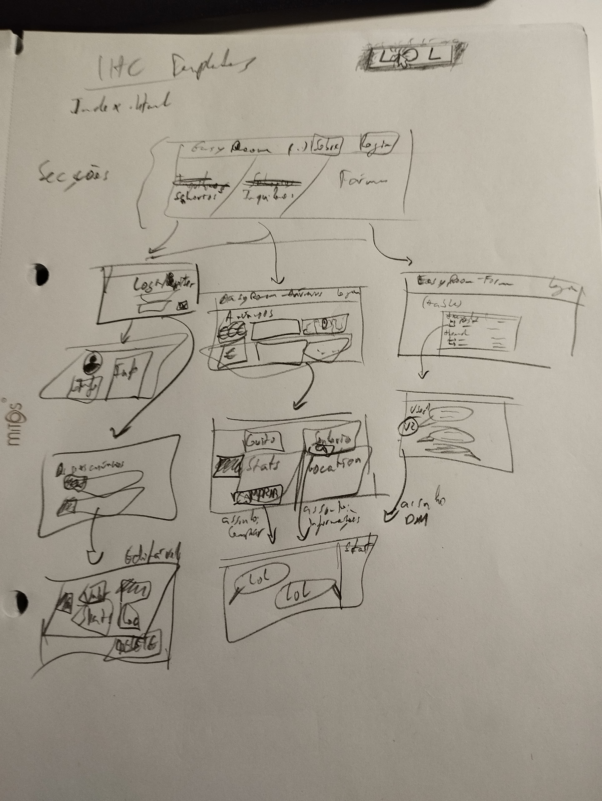
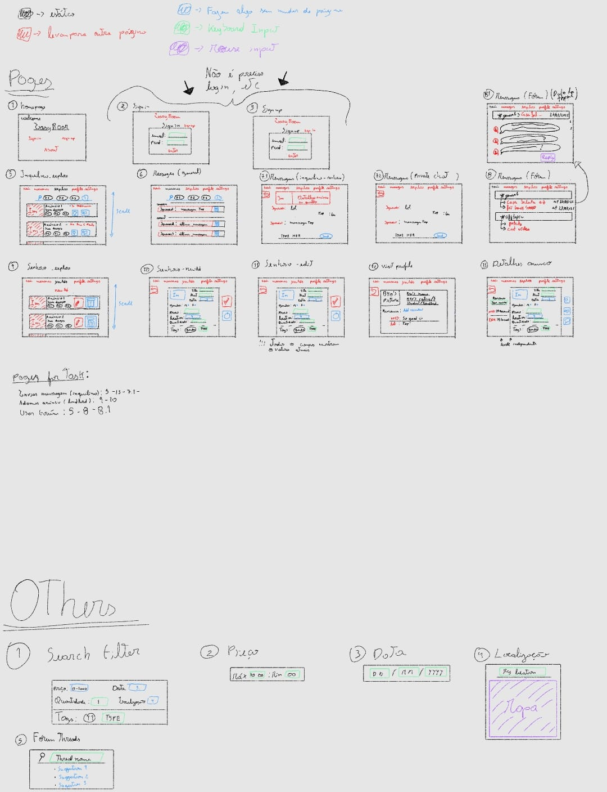
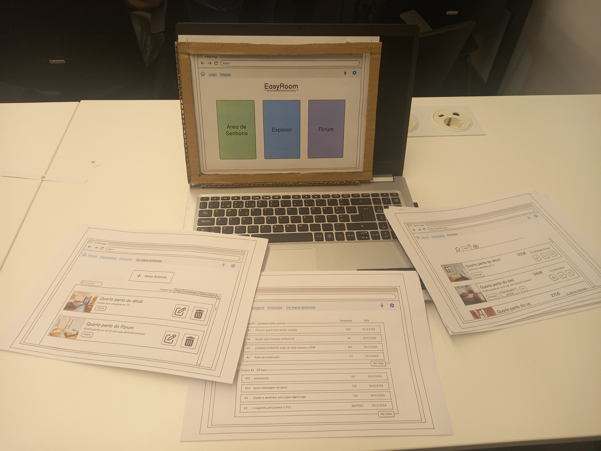

[Back to main Logbook Page](../hci_logbook.md)

---
# Low Fidelity Prototype and Evaluation

## D.1. Low Fidelity Prototype
Para desenvolvermos o nosso Low Fidelity Prototype, começámos por fazer esboços gerais dos pontos principais que gostaríamos de implementar. Depois disso, evoluímos o design a partir dessa base, começando a especificar layouts, tipos de páginas que pudessem existir/ser relevantes numa fase inicial, bem como algum conteúdo nas mesmas.

Passada esta fase inicial de esboços à mão, decidimos usar alguma ferramenta para dar mais vida às nossas ideias. Decidimos usar o Balsamiq, pois achámos que nos permitia mais liberdade de desenvolvimento, ao mesmo tempo que nos permitia manter uma interface intuitiva para os futuros testers.

Acabámos por imprimir os designs, para que os utilizadores podessem experimentar e dar feedback fisicamente. Criámos igualmente uma moldura para colocar à volta das folhas imprimidas, para simular o ecrã de um computador, uma vez que estamos a pensar desenvolver a nossa plataforma para web. Considerámos que poderia tornar o protótipo mais fiel à implementação futura que planeamos fazer.

Focámo-nos no desenvolvimento de três tasks (que abrangessem as principais features), nomeadamente:
1. **Publicação de um anúncio por parte de um senhorio:**
>"Suponha que está no papel de um senhorio, o senhor Miguel Avô, que acabou de comprar um apartamento e pretende publicar informação sobre um dos quartos a arrendar. Aceda à área de senhorio e crie/publique um novo anúncio com os seguintes detalhes":
>
>**Nome:** Quarto perto do deti
>
>**Data:** 1/04/2025
>
>**Género:** Rapaz
>
>**Preço:** 320
>
>**Nº Quartos:** 1
>
>**Descrição:** Quarto grande num t2
>
>**Localização:** Aveiro, Aveiro, Avenida Dr. Lourenço Peixinho…
>
>**Idade:** 18 a 23
>
>**Casais:** Não
>
>**Despesas incluídas:** Sim
>
>**Casa de banho:** individual
>
>**Tags:** Rapaz, T2, Casa de Banho privativa

2. **Contacto ao senhorio por parte do estudante**
> És o Miguel Neto e acabaste de ser aceite na UA. Procura o anúncio de um quarto para rapaz em aveiro que seja perto da universidade e, de preferência, tenha uma casa de banho privativa e envie uma menssagem ao senhorio.

3. **Acesso ao fórum e resposta a post**
>"Agora, ainda como inquilino, decide passar para a secção de fórum, navegar até ao post mais recente, e responder ao assunto em questão com algum texto."

Aqui ficam alguns dos destaques desta etapa do protótipo, no formato de fotografia. Se houver curiosidade em consultar as restantes fotografias, ver a seguinte pasta: [LFD_development_photos](./LFD_development_photos/)

  
  

---
## D.2. Prototype Evaluation

Para a avaliação do protótipo, vários dos colegas da nossa turma prática testaram-no, de acordo com as indicações das tasks descritas anteriormente. Dividimos as tarefas da explicação das tasks, passagem das folhas para simular interatividade e anotação de apontamentos equitativamente pelos 3 membros do grupo, rodando entre todos dependendo de quantos membros estivessem presentes no momento em que um novo teste fosse começar.

A prestação dos testers foi bastante positiva, tendo todos eles conseguido completar todas as tasks que lhes foram propostas com relativa facilidade. No geral, o feedback que foi dado foi favorável.

No total, 7 pessoas testaram o nosso Low Fidelity Prototype. Tomámos notas não só de qualquer comentário ou crítica que nos foi dado ao longo da testagem, mas também de qualquer tipo de entrave ou dificuldade que um ou outro user fosse tendo. Assim sendo, ficámos com os seguintes registos:

#### Pessoa 1
- Demonstrou dúvidas acerca da representação do botão de coração ser para reviews ou não;
- Sugeriu que em pop-ups, utilizar uma cor de fundo na página poderia levar o utilizador a entender que pode clicar fora para sair;
- Propôs que as mensagens do fórum dentro do post fossem todas alinhadas à esquerda, comos os fóruns tradicionais.

#### Pessoa 2
- Demonstrou dúvidas nos botões com setas presentes na preview do anúncio antes de publicar;
- Foi proposto melhorar a claridade do botão de contacto de senhorios, pois o ícone pode induzir em erro para abrir uma secção de comentários que já existe;
- Apontou que o post mais recente do fórum não está clara pela ordem dos posts em cada thread. 

#### Pessoa 3
- Propôs opções default neutras nos diversos dropdowns da criação de um anúncio;
- Achou indicado remover o botão de informação de um anúncio, visto que clicar no retângulo todo já leva o utilizador à mesma página.

#### Pessoa 4
- Na criação de um anúncio, achou interessante na escolha da localização haver uma seleção através de um mapa, além das simples 3 entradas de texto presentes;
- Na pesquisa de anúncios, aquando da utilização de filtros, podia existir um botão de aceitar/adicionar o filtro escolhido para ser mais intuitivo ao utilizador. 

#### Pessoa 5
- Considerou como a pessoa 3 o botão de informação de anúncio redundante, apesar de considerar que pode ser uma ajuda válida;
- Achou o protótipo do site intuitivo de um ponto de vista geral.
  
#### Pessoa 6
- Sugeriu o dropdown dos distritos ser exclusivamente vertical;
- Também encontrou problemas em compreender as setas de voltar atrás ou de editar, na secção de preview da criação do anúncio. Sugeriu o seu reposicionamento;
- Considerou que o botão de explorar devia ser mais claro, na página inicial;
- Propôs uma melhoria do filtro, em geral.
  
#### Pessoa 7 
- Achou que devia ser clarificado o contexto de aquisição de quartos idealizado pela nossa proposta.

Vale a pena destacar que estes apontamentos são na sua grande maioria sugestões/pontos a melhorar, pois considerámos que era mais benéfico registar coisas que pudessem ser aperfeiçoadas ou alteradas comparativamente a feedback geral positivo.

Aqui ficam alguns dos destaques desta etapa do protótipo, no formato de fotografia. Se houver curiosidade em consultar as restantes fotografias, ver a seguinte pasta: [LFD_testing_photos](./LFD_testing_photos/)

---
[Back to main Logbook Page](../hci_logbook.md)

---
