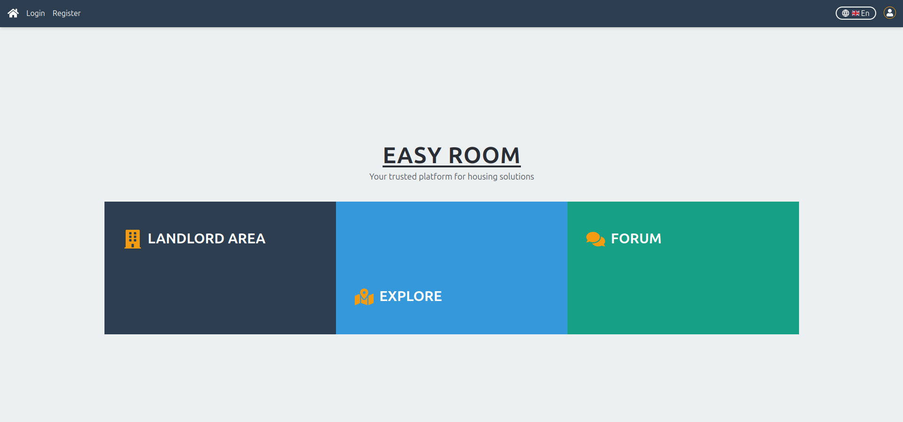

[Back to main Logbook Page](../hci_logbook.md)

---

# E. Functional Prototype and Evaluation

# Prototype
No desenvolvimento do nosso functional prototype, recorremos a tecnologias como React, Tailwind CSS e Flask, como estipulado nas stages anteriores. Começámos pelo desenvolvimento das 3 tasks principais, mas procurámos expandi-las, libertando-nos das restrições do low-fidelity prototype. 

Podemos dividir o workflow de trabalho em 4 secções principais: seccção de Fórum, área de senhorio e zona de exploração de anúncios (as 3 tasks desenvolvidas no LFP), bem como uma aba de mensagens (presente na navbar do LFP, mas não desenvolvido no mesmo).

* **Fórum**: página com diversas conversas e tópicos, com possibilidade de criar uma nova "thread" no fórum, filtrar pelas threads existentes e enviar mensagens dentro de cada thread existente;
* **Área de Senhorio**: página com todos os anúncios publicados por um determinado senhorio, com possibilidade de criar um novo anúncio (com respetivo formulário multi-step a preencher), editar ou remover anúncios existentes, e ativar ou desativar anúncios criados, para melhor controlo e flexibilidade para o senhorio;
* **Mensagens**: página com todo o conjunto de conversas que um determinado inquilino tem com senhorios e vice-versa, com possibilidade de enviar mensagem para uma determinada pessoa, ou arquivar/recuperar uma determinada conversa;
* **Exploração de anúncios**: página que dá display de todos os anúncios de alojamentos presentes no website, com possibilidade de pesquisa e filtragem de resultados, bem como acesso direto a mensagens e aos detalhes de cada alojamento.

Para além disto, foram também criadas páginas/elementos que fornecem funcionalidades complementares e quality of life improvements, nomeadamente:
* **Homepage** para fácil acesso às abas chave do website;
* **Página de Login/Registo** de contas no website;
* **Página de perfil**, com possibilidade de inquilinos e senhorios darem review entre si, e facilitar o envio de mensagens;
* **Botão de mudança de linguagem**, com opção entre português e inglês.

Na seguinte pasta encontram-se imagens das diferentes secções do website: [1st iter. Functional Prototype](./1st_Iteration_FunctionalPrototype/)

# E.X. User Evaluation
Para testar o nosso functional prototype, criámos um conjunto de 6 tasks que explorassem um pouco de cada parte do website. [Tasks](./41549_IHC_UsabilityTestTasksforUser.pdf)

No final, deixámos o utilizador explorar de livre vontade o que quisesse.

Enquanto cada tester cumpria cada task, 2 membros do grupo encontravam-se a tirar apontamentos e a observar o comportamento e feedback dado, com recurso a um formulário google forms.
No final da sessão de teste, cada pessoa preenchia um outro formulário, para obter informação adicional sobre os testers do sistema.

---
[Back to main Logbook Page](../hci_logbook.md)

---